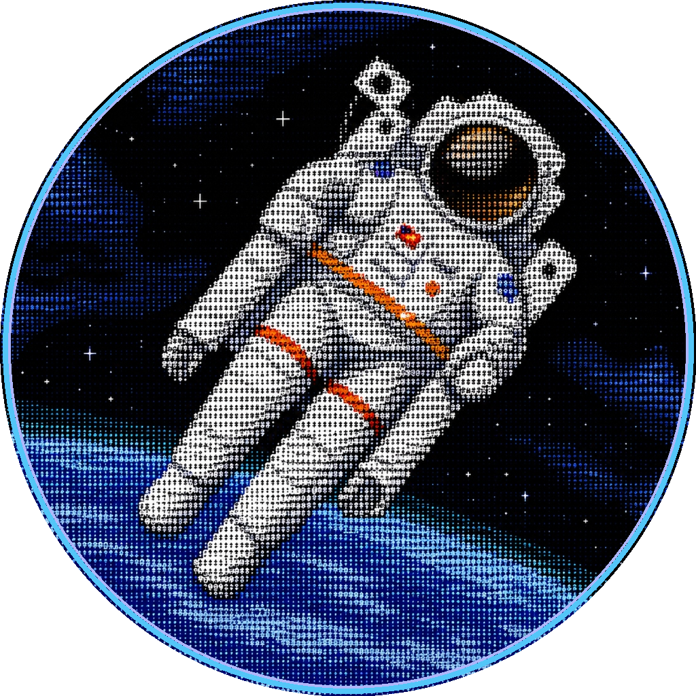
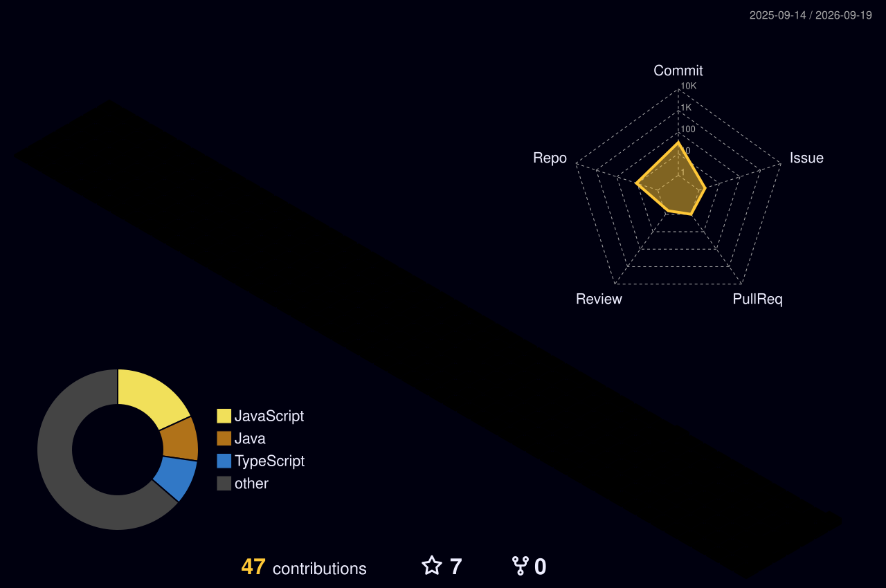
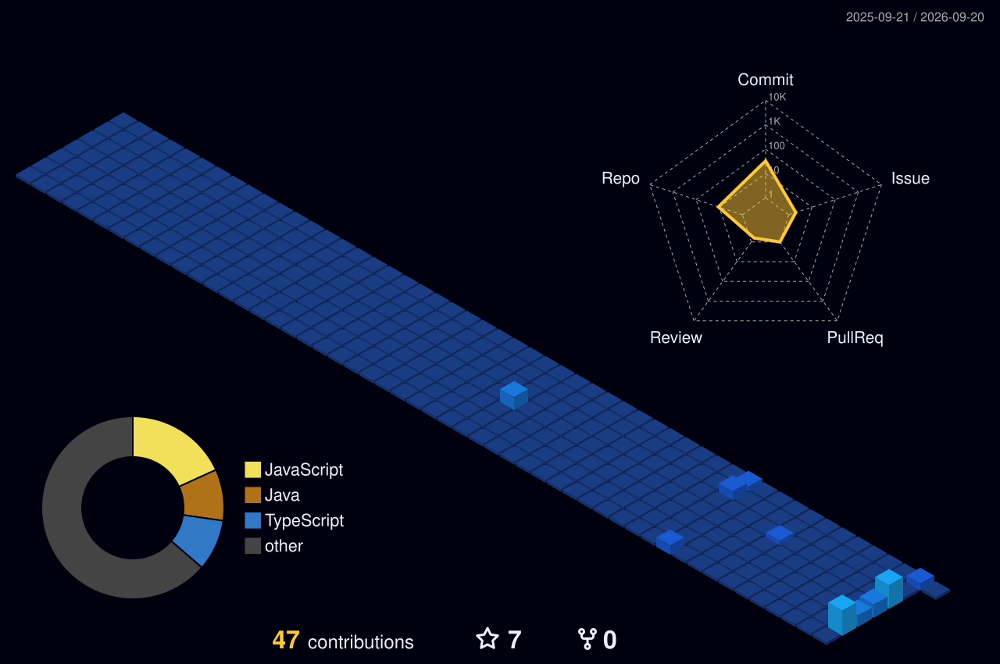

<!-- HERO POSTER: CODYSEEY -->

  

# Chinmay Sonar

### Google Student Ambassador &bull; AI Agent Systems Architect &bull; UI/UX Designer

  

Building autonomous multi-agent systems with clean architecture, scalable inference, and high-fidelity product design.

---

## ✦ About Me

<table border="0" width="100%">
  <tr>
    <td width="68%" valign="top">
      

        I am an <b>AI Systems Architect</b> and <b>Google Student Ambassador</b> obsessed with engineering intelligent, autonomous software. My work focuses on designing <b>multi-agent swarms, self-healing cognitive loops, and tool-augmented LLM pipelines</b> using Gemini, LangChain, and state-of-the-art agent frameworks.
      

      

        Bridging the gap between artificial intelligence and world-class product experience, I craft production-ready interfaces with <b>Figma, React 19, TypeScript, and Next.js</b>.
      

      

        🏆 <b>Hackathon Triumph:</b> Built <b>Codyseey Captionate</b>, winning the <b>AMD Developer Hackathon ACT II</b> by infusing real-time video subtitles with live emotional telemetry and low-latency ROCm acceleration.
      

      

        🎓 <b>Google Student Ambassador:</b> Leading campus tech initiatives, mentoring student developers in applied generative AI, and fostering collaborative engineering culture.
      

    </td>
    <td width="32%" align="center" valign="middle">
      
       
      <code>MISSION // ODYSSEY</code>
    </td>
  </tr>
</table>

---

## ⚡ Core Arsenal & Skills

<table border="0" width="100%">
  <tr>
    <td width="33%" valign="top">
      <h4>🧠 AI &amp; Agent Systems</h4>
      <ul>
        <li>Autonomous Agent Swarms</li>
        <li>LangChain &amp; Tool-Calling LLMs</li>
        <li>Gemini Multimodal API</li>
        <li>PyTorch &amp; AMD ROCm</li>
        <li>Emotion &amp; Sentiment Telemetry</li>
      </ul>
    </td>
    <td width="33%" valign="top">
      <h4>🎨 UI/UX &amp; Design Systems</h4>
      <ul>
        <li>Figma Component Architecture</li>
        <li>React 19 &amp; Next.js</li>
        <li>TypeScript &amp; Tailwind CSS</li>
        <li>Micro-Interactions &amp; Motion</li>
        <li>Design Tokens &amp; Responsive Layouts</li>
      </ul>
    </td>
    <td width="33%" valign="top">
      <h4>🛠️ Systems &amp; Cloud</h4>
      <ul>
        <li>FastAPI &amp; Python Services</li>
        <li>Node.js &amp; WebSockets</li>
        <li>Docker &amp; Containerization</li>
        <li>Google Cloud Platform (GCP)</li>
        <li>Git Workflows &amp; CI/CD</li>
      </ul>
    </td>
  </tr>
</table>

   
  

---

## 🚀 Featured Engineering

<table border="0" width="100%">
  <tr>
    <td width="50%" valign="top">
      <h4>🏆 <a href="https://github.com/Chinmay-sonar/The-AMD-Developer-Hackathon-ACT-II">Codyseey Captionate</a></h4>
      
<b>AMD Developer Hackathon ACT II Winner</b> 
      Real-time video intelligence system overlaying live subtitles infused with multimodal emotional telemetry and sentiment trajectory analysis.

      <code>Python</code> &bull; <code>PyTorch</code> &bull; <code>AMD ROCm</code> &bull; <code>Gemini</code> &bull; <code>FastAPI</code>
    </td>
    <td width="50%" valign="top">
      <h4>🏙️ <a href="https://github.com/Chinmay-sonar/Orion-Connect">Orion-Connect</a></h4>
      
<b>Autonomous Civic Problem Reporting Platform</b> 
      Smart civic engagement and municipal problem resolution engine engineered for Vadodara City with automated issue routing.

      <code>React 19</code> &bull; <code>TypeScript</code> &bull; <code>Node.js</code> &bull; <code>Figma</code> &bull; <code>WebSockets</code>
    </td>
  </tr>
  <tr>
    <td colspan="2" valign="top">
      <h4>🏛️ <a href="https://github.com/Chinmay-sonar/The-Vadpadraka">The-Vadpadraka</a></h4>
      
<b>Spatial Architecture &amp; Cultural Heritage Discovery Engine</b> 
      Next-generation interactive platform dedicated to preserving the cultural identity, historical narrative, and architectural treasures of Vadodara.

      <code>Next.js</code> &bull; <code>Tailwind CSS</code> &bull; <code>Three.js</code> &bull; <code>UI/UX Systems</code>
    </td>
  </tr>
</table>

---

## 🏙️ 3D Contribution Skyline

  
<i>Autonomous 3D isometric representation of my GitHub activity and commit density:</i>

  
    
  

    
<b>🔍 Toggle Monochrome Night View</b>

     
    
  

---

## 📊 Performance Telemetry

  

---

## 🤝 Connect &amp; Collaborate

  
  &nbsp;&nbsp;&nbsp;
  
  &nbsp;&nbsp;&nbsp;
  
  &nbsp;&nbsp;&nbsp;
  
  &nbsp;&nbsp;&nbsp;
  

 

  <code>ENGINEERED WITH DISCIPLINE &amp; IMPACT BY CHINMAY SONAR</code>

