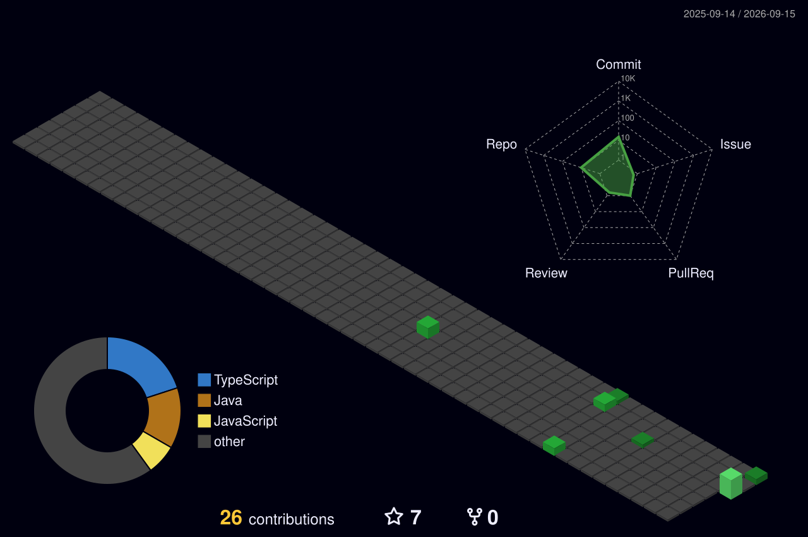

<!-- HERO POSTER: CODYSEEY -->

  

# Chinmay Sonar

### Google Student Ambassador &bull; AI Agent Systems Architect &bull; UI/UX Designer

  

Building autonomous multi-agent systems with clean architecture, scalable inference, and high-fidelity product design.

---

## 🚀 About Me

Hey there! I’m **Chinmay** &mdash; a builder who firmly believes that if a piece of software doesn’t solve a real problem or looks like a 1998 spreadsheet, it simply shouldn’t exist.

Here is the short version of what I do:
- 🤖 **I build AI that actually works, not just chats.** Most people treat LLMs like a glorified search box. I build autonomous agents &mdash; think of them as digital co-pilots that can browse the web, digest hours of video, triage civic complaints, and do the heavy lifting in the background while you sleep.
- 🎨 **I refuse to ship ugly interfaces.** Great engineering deserves great design. I craft frontends using **React 19, TypeScript, and modern motion physics** that feel fast, cinematic, and butter-smooth.
- 🏆 **I love building under pressure.** Won the **AMD Developer Hackathon ACT II** with *Codyseey Captionate* (a real-time subtitle engine that tracks speaker emotion and tone), served as a **Google Student Ambassador**, and constantly turn wild ideas into working production apps.

When I’m not tracking down a rogue async bug at 2 AM or obsessing over 4 pixels of padding, I’m usually experimenting with new agent architectures or brainstorming the next build. 

If you’re building something ambitious, looking to collaborate, or just want to talk tech that genuinely moves the needle &mdash; my inbox is always open!

 

---

## ⚡ Core Arsenal & Skills

<table border="0" width="100%">
  <tr>
    <td width="33%" valign="top">
      <h4>🧠 AI &amp; Agent Systems</h4>
      <ul>
        <li>Autonomous Agent Swarms</li>
        <li>LangChain &amp; Tool-Calling LLMs</li>
        <li>Gemini Multimodal API</li>
        <li>PyTorch &amp; AMD ROCm</li>
        <li>Emotion &amp; Sentiment Telemetry</li>
      </ul>
    </td>
    <td width="33%" valign="top">
      <h4>🎨 UI/UX &amp; Design Systems</h4>
      <ul>
        <li>Figma Component Architecture</li>
        <li>React 19 &amp; Next.js</li>
        <li>TypeScript &amp; Tailwind CSS</li>
        <li>Micro-Interactions &amp; Motion</li>
        <li>Design Tokens &amp; Responsive Layouts</li>
      </ul>
    </td>
    <td width="33%" valign="top">
      <h4>🛠️ Systems &amp; Cloud</h4>
      <ul>
        <li>FastAPI &amp; Python Services</li>
        <li>Node.js &amp; WebSockets</li>
        <li>Docker &amp; Containerization</li>
        <li>Google Cloud Platform (GCP)</li>
        <li>Git Workflows &amp; CI/CD</li>
      </ul>
    </td>
  </tr>
</table>

   
  

---

## 🚀 Featured Engineering

<table border="0" width="100%">
  <tr>
    <td width="50%" valign="top">
      <h4>🏆 <a href="https://github.com/Chinmay-sonar/The-AMD-Developer-Hackathon-ACT-II">Codyseey Captionate</a></h4>
      
<b>AMD Developer Hackathon ACT II Winner</b> 
      Real-time video intelligence system overlaying live subtitles infused with multimodal emotional telemetry and sentiment trajectory analysis.

      <code>Python</code> &bull; <code>PyTorch</code> &bull; <code>AMD ROCm</code> &bull; <code>Gemini</code> &bull; <code>FastAPI</code>
    </td>
    <td width="50%" valign="top">
      <h4>⚡ <a href="https://github.com/Chinmay-sonar/hackforge-command-system">HackForge Command System</a></h4>
      
<b>Autonomous Multi-Agent Hackathon Intelligence Engine</b> 
      CLI-first multi-agent orchestration architecture utilizing specialized subroutines for web extraction, judging criteria evaluation, and tactical roadmaps.

      <code>Node.js</code> &bull; <code>Groq LPU</code> &bull; <code>Gemini API</code> &bull; <code>Multi-Agent</code> &bull; <code>Zod</code>
    </td>
  </tr>
  <tr>
    <td width="50%" valign="top">
      <h4>🧠 <a href="https://github.com/Chinmay-sonar/instagram-second-brain-agent">Instagram Second Brain Agent</a></h4>
      
<b>Multimodal Knowledge Synthesizer &amp; Obsidian Pipeline</b> 
      End-to-end autonomous agent capturing and converting technical reels, carousels, and media into structured, backlinked Obsidian Second Brain notes.

      <code>Python</code> &bull; <code>Gemini 1.5</code> &bull; <code>NVIDIA NIM</code> &bull; <code>Telegram Bot</code> &bull; <code>Obsidian</code>
    </td>
    <td width="50%" valign="top">
      <h4>🏙️ <a href="https://github.com/Chinmay-sonar/Orion-Connect">Orion-Connect</a></h4>
      
<b>Autonomous Civic Problem Reporting Platform</b> 
      Smart civic engagement and municipal problem resolution engine engineered for Vadodara City with automated issue routing and real-time tracking.

      <code>React 19</code> &bull; <code>TypeScript</code> &bull; <code>Node.js</code> &bull; <code>WebSockets</code> &bull; <code>Figma</code>
    </td>
  </tr>
  <tr>
    <td width="50%" valign="top">
      <h4>⚡ <a href="https://github.com/Chinmay-sonar/n8n-agent-workflows">n8n Media Extraction Pipeline</a></h4>
      
<b>Autonomous Web Media Scraper &amp; Zero-Tunneling Telegram Agent</b> 
      Production-grade n8n workflow engine and long-polling bridge extracting high-res media, deduplicating assets, and delivering native batch albums to Telegram.

      <code>n8n</code> &bull; <code>JavaScript</code> &bull; <code>Telegram Bot API</code> &bull; <code>Automation</code> &bull; <code>DOM Parser</code>
    </td>
    <td width="50%" valign="top">
      <h4>🛰️ <a href="https://github.com/Chinmay-sonar/agent-telemetry-log">Agent Telemetry &amp; Streak Keeper</a></h4>
      
<b>Autonomous Scheduled Heartbeat &amp; Contribution Pipeline</b> 
      Self-governing n8n workflow recording daily telemetry, system heartbeats, and cluster health metrics to maintain continuous developer activity.

      <code>n8n</code> &bull; <code>GitHub REST API</code> &bull; <code>JavaScript</code> &bull; <code>Automation</code>
    </td>
  </tr>
</table>

---

## 🏙️ 3D Contribution Skyline

  
<i>Autonomous 3D isometric representation of my GitHub activity and commit density:</i>

  

---

## 📊 Performance Telemetry

  

---

## 🤝 Connect &amp; Collaborate

  
  &nbsp;&nbsp;&nbsp;
  
  &nbsp;&nbsp;&nbsp;
  
  &nbsp;&nbsp;&nbsp;
  
  &nbsp;&nbsp;&nbsp;
  

 

  <code>ENGINEERED WITH DISCIPLINE &amp; IMPACT BY CHINMAY SONAR</code>

