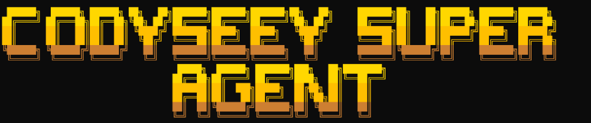
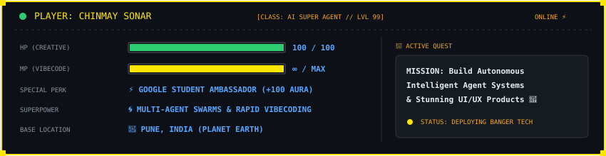
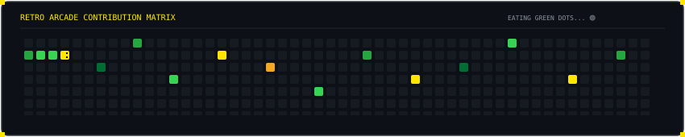

<div align="center">

  <!-- Pixel-Art Arcade Hero Banner -->
  

  <br/><br/>

  <!-- Dynamic Retro Typing Animation (Press Start 2P Pixel Font) -->
  <a href="https://github.com/Chinmay-sonar">
    
  </a>

  <br/>

  <!-- Identity Badges & Accreditations -->
  <p align="center">
    <a href="https://www.linkedin.com/in/chinmaysonar">
      
    </a>
    
    
    
    
  </p>

</div>

---

### 🕹️ `PLAYER STATUS // ARCADE HUD`

<div align="center">
  
</div>

<br/>

```yaml
# 👨‍💻 CODYSEEY PROFILE TELEMETRY
player: Chinmay Sonar
alias: codyseey
role: Google Student Ambassador | AI Super Agent Architect | UI/UX Engineer
headquarters: Pune, Maharashtra, India 🇮🇳
passions: [Agentic Swarms, Multimodal AI, Cognitive Subtitles, Civic Tech, Motion Design]
current_mission: "Architecting autonomous agents that eliminate friction between thought and production code."
superpowers: "High-voltage vibecoding, Figma-to-code precision, and zero-bullshit product execution."
```

---

### 🚀 `FLAGSHIP WEAPONS // FEATURED PROJECTS`

<table>
  <tr>
    <td width="50%" valign="top">
      <h3 align="left">🎬 01. Codyseey Captionate (VibeStream)</h3>
      <p><b>AMD Developer Hackathon ACT II Showcase</b></p>
      <p>Next-generation video subtitle engine infusing <i>real-time emotional telemetry</i> and cognitive sentiment tracking into video subtitles, backed by AMD Cloud ROCm and Fireworks AI.</p>
      <p>
        
        
        
        
      </p>
      <p>👉 <a href="https://github.com/Chinmay-sonar/The-AMD-Developer-Hackathon-ACT-II"><b>Explore The-AMD-Developer-Hackathon-ACT-II »</b></a></p>
    </td>
    <td width="50%" valign="top">
      <h3 align="left">🏙️ 02. Orion Connect</h3>
      <p><b>Modern Civic Problem Reporting &amp; Engagement Platform</b></p>
      <p>An intelligent civic action platform designed for Vadodara City, allowing citizens to report urban issues seamlessly with real-time AI classification and routing.</p>
      <p>
        
        
        
      </p>
      <p>👉 <a href="https://github.com/Chinmay-sonar/Orion-Connect"><b>Explore Orion-Connect »</b></a></p>
    </td>
  </tr>
  <tr>
    <td width="50%" valign="top">
      <h3 align="left">🏛️ 03. The Vadpadraka</h3>
      <p><b>Cultural &amp; Civic Experience Platform</b></p>
      <p>Full-stack digital ecosystem built to preserve, celebrate, and modernize cultural heritage and community discovery through intuitive interfaces and intelligent content curation.</p>
      <p>
        
        
        
      </p>
      <p>👉 <a href="https://github.com/Chinmay-sonar/The-Vadpadraka"><b>Explore The-Vadpadraka »</b></a></p>
    </td>
    <td width="50%" valign="top">
      <h3 align="left">🤖 04. Autonomous Agent Swarms</h3>
      <p><b>Agentic Vibecoding Systems &amp; Autonomous Workflows</b></p>
      <p>Multi-agent orchestration pipelines utilizing tool-calling LLMs, memory graphs, and self-healing code synthesis to build production software at blistering velocity.</p>
      <p>
        
        
        
      </p>
      <p>👉 <a href="https://github.com/Chinmay-sonar"><b>View AI Agent Experiments »</b></a></p>
    </td>
  </tr>
</table>

---

### ⚡ `TECH MATRIX // THE ARSENAL`

<div align="center">

  <table>
    <tr>
      <td align="center" width="25%"><b>🤖 AGENTIC AI &amp; LLMS</b></td>
      <td align="center" width="25%"><b>🎨 UI/UX &amp; DESIGN</b></td>
      <td align="center" width="25%"><b>⚡ FULL-STACK VIBECODE</b></td>
      <td align="center" width="25%"><b>☁️ CLOUD &amp; DEVOPS</b></td>
    </tr>
    <tr>
      <td align="center">
        <br/>
        <br/>
        <br/>
        <br/>
        <br/>
        
      </td>
      <td align="center">
        <br/>
        <br/>
        <br/>
        <br/>
        <br/>
        
      </td>
      <td align="center">
        <br/>
        <br/>
        <br/>
        <br/>
        <br/>
        
      </td>
      <td align="center">
        <br/>
        <br/>
        <br/>
        <br/>
        <br/>
        
      </td>
    </tr>
  </table>

</div>

---

### 🐍 `RETRO CONTRIBUTION MATRIX // EATING THE DOTS`

<div align="center">

  <!-- Contribution Grid Arcade Snake Game -->
  <picture>
    <source media="(prefers-color-scheme: dark)" srcset="https://raw.githubusercontent.com/Chinmay-sonar/Chinmay-sonar/output/github-contribution-grid-snake-dark.svg">
    <source media="(prefers-color-scheme: light)" srcset="https://raw.githubusercontent.com/Chinmay-sonar/Chinmay-sonar/output/github-contribution-grid-snake.svg">
    
  </picture>

  <p align="center"><i>Autonomous retro snake dynamically grazing on GitHub commit nodes 🟢⚡</i></p>

</div>

---

### 📊 `PERFORMANCE TELEMETRY // STREAK STATS`

<div align="center">

  <!-- Custom Dark + Gold Themed Streak Stats matching CODYSEEY palette -->
  <a href="https://github.com/Chinmay-sonar">
    
  </a>

</div>

---

### 🏆 `OFFICIAL GITHUB ACHIEVEMENTS`

<div align="center">

  <a href="https://github.com/Chinmay-sonar?tab=achievements">
    
    
    
    
    
  </a>

  <p align="center">
    
    
  </p>

</div>

---

### 📡 `TRANSMISSION LINE // CONNECT WITH CHINMAY`

<div align="center">

  <p><b>Recruiters, founders, and fellow builders: My inbox is always open for ambitious agentic projects and high-impact software roles.</b></p>

  <a href="https://www.linkedin.com/in/chinmaysonar">
    
  </a>
  &nbsp;
  <a href="https://x.com/HeyChinmay">
    
  </a>
  &nbsp;
  <a href="https://instagram.com/codyseey">
    
  </a>
  &nbsp;
  <a href="mailto:chinmaysonarofficial@gmail.com">
    
  </a>

  <br/><br/>

  <p align="center">
    <i>Designed with ❤️, Figma aesthetic discipline, and Google engineering standards by Chinmay Sonar.</i>
  </p>

</div>
